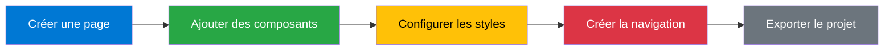

<div align="center">

# 🎨 Web Editor

### Éditeur visuel de sites web moderne et intuitif

[]()
[]()

</div>

---

## 📑 Table des matières

| Section | Description |
|---------|-------------|
| [🚀 Introduction](#-introduction) | Présentation générale et fonctionnalités |
| [⚙️ Installation](#️-installation) | Guide d'installation rapide |
| [🎯 Démarrage rapide](#-démarrage-rapide) | Premiers pas avec l'éditeur |
| [🖥️ Interface utilisateur](#️-interface-utilisateur) | Description de l'interface |
| [📄 Gestion des pages](#-gestion-des-pages) | Créer et gérer vos pages |
| [🧩 Système de composants](#-système-de-composants) | Composants HTML et personnalisés |
| [🌳 Arborescence](#-arborescence-et-navigation) | Navigation dans la structure |
| [🎨 Propriétés et styles](#-propriétés-et-styles) | Édition visuelle des styles |
| [🎯 Design tokens](#-design-tokens-et-variables-css) | Tokens et variables CSS |
| [🔗 Graphe de navigation](#-graphe-de-navigation) | Visualiser les liens inter-pages |
| [💾 Import/Export](#-importexport) | Sauvegarder et exporter |
| [⌨️ Raccourcis clavier](#️-raccourcis-clavier) | Raccourcis pour gagner du temps |
| [⚡ Fonctionnalités avancées](#-fonctionnalités-avancées) | Outils professionnels |

---

## 🚀 Introduction

Web Editor est un éditeur visuel de sites web qui permet de créer des interfaces utilisateur de manière intuitive via un système de glisser-déposer. L'application génère du code HTML/CSS propre et exportable, avec support pour les pages multiples, les composants réutilisables et la navigation inter-pages.

### ✨ Principales fonctionnalités

<table>
<tr>
<td width="50%">

**🎯 Édition visuelle**
- Éditeur WYSIWYG avec drag & drop
- Multi-sélection et manipulation
- Redimensionnement en direct
- Grille magnétique

</td>
<td width="50%">

**📄 Gestion de projet**
- Système de pages multiples
- Routage et navigation
- Historique undo/redo
- Export JSON et ZIP

</td>
</tr>
<tr>
<td>

**🧩 Composants**
- Bibliothèque HTML standard
- Composants personnalisés
- Import/Export de composants
- Duplication et réutilisation

</td>
<td>

**🎨 Design**
- Design tokens
- Variables CSS globales
- Pseudo-styles (:hover, :active...)
- Mode CSS brut

</td>
</tr>
<tr>
<td>

**🔗 Navigation**
- Graphe interactif
- Liens inter-pages
- Actions (click, dblclick, load)
- Visualisation de la structure

</td>
<td>

**⚡ Performance**
- Zoom/Pan fluide
- Sauvegarde automatique
- Mode responsive
- Interface optimisée

</td>
</tr>
</table>

---

## ⚙️ Installation

### 📋 Prérequis

> **Serveur web local** : Apache, Nginx, WAMP, XAMPP, etc.  
> **Navigateur moderne** : Chrome, Firefox, Edge (dernières versions)

### 📦 Installation

```bash
# 1. Cloner ou télécharger le projet
cd /votre/repertoire/web

# 2. Ouvrir dans le navigateur
http://localhost/editor/index.php
```

> ℹ️ **Note** : Aucune configuration supplémentaire n'est requise

---

## 🎯 Démarrage rapide

### 🎬 Créer votre première page

```
┌─────────────────────────────────────────┐
│  1️⃣  Cliquer sur "Nouvelle page"       │
│     ↓                                    │
│  2️⃣  Configurer titre, route, méta     │
│     ↓                                    │
│  3️⃣  Glisser des composants             │
│     ↓                                    │
│  4️⃣  Styliser via le panneau            │
│     ↓                                    │
│  5️⃣  Exporter le projet                 │
└─────────────────────────────────────────┘
```

### 🔄 Workflow type

<div align="center">



</div>

---

## 🖥️ Interface utilisateur

### 📊 Layout de l'interface

```
┌─────────────────────────────────────────────────────────────────┐
│                    🎨 BARRE SUPÉRIEURE                          │
│  Importer │ Exporter │ Effacer │ Graphe │ Tokens │ Mode        │
├──────────┬──────────────────────────────────────────┬───────────┤
│          │                                          │           │
│  PANNEAU │            WORKSPACE                     │  PANNEAU  │
│  GAUCHE  │         (Zone de travail)                │   DROIT   │
│          │                                          │           │
│  • Comp. │         Glisser-Déposer                  │ • Proprié.│
│  • Arbre │         Zoom / Pan                       │ • Tokens  │
│  • Pages │         Multi-sélection                  │ • CSS Var │
│          │                                          │           │
└──────────┴──────────────────────────────────────────┴───────────┘
```

### 🎛️ Barre supérieure

| Bouton | Description |
|--------|-------------|
| 📂 **Importer** | Charger un projet JSON existant |
| 💾 **Exporter** | Sauvegarder en JSON ou ZIP |
| 🗑️ **Effacer** | Supprimer tout le projet |
| 🔗 **Graphe** | Visualiser la structure de navigation |
| 🎨 **Tokens** | Gérer les design tokens |
| 🧩 **Mode Composant** | Créer des composants réutilisables |

### 📂 Panneau gauche

<table>
<tr>
<th>Onglet</th>
<th>Description</th>
</tr>
<tr>
<td>🧩 <strong>Composants</strong></td>
<td>Bibliothèque de composants HTML standard et personnalisés</td>
</tr>
<tr>
<td>🌳 <strong>Arborescence</strong></td>
<td>Vue hiérarchique des éléments de la page courante</td>
</tr>
<tr>
<td>📄 <strong>Pages</strong></td>
<td>Liste et gestion des pages du projet</td>
</tr>
</table>

### 🎨 Zone centrale (Canvas)

> Workspace où vous construisez visuellement vos pages

**Interactions supportées :**
- 🔍 Zoom/dézoom : `Ctrl` + molette
- 🖐️ Pan : `Ctrl` + `Shift` + clic gauche
- ☑️ Sélection multiple : `Ctrl` + clic
- 📏 Redimensionnement : Poignées de redimensionnement

### ⚙️ Panneau droit

<table>
<tr>
<th>Onglet</th>
<th>Fonction</th>
</tr>
<tr>
<td>🎛️ <strong>Propriétés</strong></td>
<td>Édition des attributs et styles de l'élément sélectionné</td>
</tr>
<tr>
<td>🎨 <strong>Tokens</strong></td>
<td>Gestion des design tokens (couleurs, typographie, espacement)</td>
</tr>
<tr>
<td>💅 <strong>Variables CSS</strong></td>
<td>Variables CSS globales du projet</td>
</tr>
</table>

---

## 📄 Gestion des pages

### ➕ Créer une page

```
1️⃣ Onglet "Pages" (panneau gauche)
   ↓
2️⃣ Cliquer sur "+ Nouvelle page"
   ↓
3️⃣ Configurer :
   • 📝 Titre : Nom de la page
   • 🔗 Route : URL (ex: /contact)
   • 📄 Description : Métadonnée SEO
```

### 🔄 Navigation entre pages

> Cliquer sur une page dans la liste pour l'éditer  
> La page courante est **mise en évidence**  
> Les éléments sont **automatiquement sauvegardés** lors du changement

### ⚙️ Propriétés de page

<details>
<summary><strong>Cliquer pour voir les options disponibles</strong></summary>

| Propriété | Description |
|-----------|-------------|
| 📝 **Titre** | Nom affiché dans l'onglet du navigateur |
| 📄 **Description** | Métadonnée pour le SEO |
| 🏷️ **Keywords** | Mots-clés pour le référencement |
| 🖼️ **Favicon** | Icône personnalisée de la page |
| 📜 **Scripts** | JavaScript personnalisé (head/body) |
| 🎨 **Styles** | CSS personnalisé pour la page |
| ⭐ **Page principale** | Définir comme page d'accueil |

</details>

### 🔧 Actions sur les pages

| Action | Raccourci | Description |
|--------|-----------|-------------|
| 📋 Dupliquer | - | Copier la page avec tous ses éléments |
| 🗑️ Supprimer | `Delete` | Retirer la page du projet (avec confirmation) |
| ℹ️ Propriétés | Icône ℹ️ | Afficher/éditer les métadonnées |

---

## 🧩 Système de composants

### 📦 Composants HTML standard

<table>
<tr>
<td width="33%">

**📦 Conteneurs**
- DIV
- Section
- Article
- Header
- Footer
- Nav

</td>
<td width="33%">

**📝 Texte**
- Heading (H1-H6)
- Paragraph
- Span
- Strong
- Em

</td>
<td width="33%">

**📋 Formulaires**
- Input
- Textarea
- Button
- Select
- Form

</td>
</tr>
<tr>
<td>

**🖼️ Médias**
- Image
- Video
- Audio

</td>
<td>

**📊 Listes**
- UL (non ordonnée)
- OL (ordonnée)
- LI (élément)

</td>
<td>

**🔗 Navigation**
- A (ancre/lien)
- Nav (menu)

</td>
</tr>
</table>

### ✨ Créer un composant personnalisé

```
┌──────────────────────────────────────┐
│ 1️⃣ Activer "Mode Composant"         │
│    (barre supérieure)                │
│         ↓                            │
│ 2️⃣ Construire le composant          │
│    (workspace vide)                  │
│         ↓                            │
│ 3️⃣ Cliquer "Sauvegarder Composant"  │
│         ↓                            │
│ 4️⃣ Nommer et confirmer              │
│         ↓                            │
│ 5️⃣ Disponible dans "Mes Composants" │
└──────────────────────────────────────┘
```

### 🎯 Utiliser un composant personnalisé

> **Mode normal** (désactiver le mode composant)  
> → Onglet "Mes Composants"  
> → Glisser vers le workspace  
> → **IDs automatiquement régénérés**

### 🔧 Gestion des composants

| Action | Description |
|--------|-------------|
| ✏️ **Charger** | Éditer un composant existant |
| 💾 **Exporter** | Télécharger en JSON |
| 📂 **Importer** | Charger depuis un fichier JSON |
| 📋 **Dupliquer** | Créer une copie |
| 🗑️ **Supprimer** | Retirer de la bibliothèque |

---

## 🌳 Arborescence et navigation

### 🌲 Vue arborescence

```
📄 Page
├─ 📦 Header
│  ├─ 🔗 Logo (Link)
│  └─ 📋 Menu (Nav)
│     ├─ 🔗 Accueil
│     ├─ 🔗 Services
│     └─ 🔗 Contact
├─ 📦 Main
│  ├─ 📝 Title (H1)
│  ├─ 📝 Paragraph
│  └─ 🔘 Button
└─ 📦 Footer
   └─ 📝 Copyright
```

**Fonctionnalités :**
- ➕ Plier/Déplier les éléments parents
- 🖱️ Cliquer pour sélectionner
- 🔀 Glisser pour réorganiser

### 🎮 Manipulation dans l'arborescence

| Action | Résultat |
|--------|----------|
| **Drag & drop** | Déplacer un élément dans un autre conteneur |
| **Clic sur flèche** | Plier/déplier les enfants |
| **Clic sur élément** | Sélectionner et afficher les propriétés |

### ⚡ Navigation dans les conteneurs

> **Problème** : Enfant sous le curseur empêche la sélection du parent  
> **Solution** : `Shift` + glisser pour déplacer le parent directement

---

## 🎨 Propriétés et styles

### 🎛️ Panneau de propriétés

<table>
<tr>
<th>Section</th>
<th>Propriétés disponibles</th>
</tr>
<tr>
<td>

**ℹ️ Générales**

</td>
<td>

- Type d'élément
- ID (unique)
- Classe CSS

</td>
</tr>
<tr>
<td>

**📝 Contenu**

</td>
<td>

- Texte interne
- Attributs HTML
- Source (src, href...)

</td>
</tr>
<tr>
<td>

**📐 Position**

</td>
<td>

- Position (absolute, relative, static)
- Left, Top, Right, Bottom
- Z-index

</td>
</tr>
<tr>
<td>

**📏 Dimensions**

</td>
<td>

- Width, Height
- Min/Max width/height
- Aspect ratio

</td>
</tr>
<tr>
<td>

**⬜ Espacement**

</td>
<td>

- Margin (externe)
- Padding (interne)
- Gap (pour flex/grid)

</td>
</tr>
<tr>
<td>

**🎨 Couleurs**

</td>
<td>

- Background
- Color (texte)
- Border
- Opacity

</td>
</tr>
<tr>
<td>

**✍️ Typographie**

</td>
<td>

- Font-family
- Font-size
- Font-weight
- Text-align

</td>
</tr>
<tr>
<td>

**📊 Affichage**

</td>
<td>

- Display (block, flex, grid...)
- Flex properties
- Grid properties

</td>
</tr>
<tr>
<td>

**✨ Pseudo-classes**

</td>
<td>

- :hover
- :active
- :focus
- ::before / ::after

</td>
</tr>
</table>

### 💻 Modes d'édition

| Mode | Description |
|------|-------------|
| **🎨 Visuel** | Champs de formulaire pour chaque propriété |
| **📝 CSS brut** | Éditeur de texte avec syntaxe colorée |

> Basculer via le bouton "CSS brut" dans le panneau

### 🔗 Actions navigation

Pour les éléments interactifs (boutons, liens) :

```
1️⃣ Sélectionner l'élément
   ↓
2️⃣ Section "Actions navigation"
   ↓
3️⃣ "+ Ajouter une action"
   ↓
4️⃣ Configurer :
   • Type : click / dblclick / load
   • Page cible : Destination
```

---

## 🎯 Design tokens et variables CSS

### 🎨 Design tokens

> Centraliser les valeurs de design pour une cohérence visuelle

#### 🌈 Couleurs

```css
--primary-color: #0078d4
--secondary-color: #28a745
--danger-color: #dc3545
--text-color: #333333
```

**Utilisation :**
1. Onglet "Tokens" → Section "Couleurs"
2. Ajouter nom + valeur hexadécimale
3. Utiliser : `var(--primary-color)`

#### ✍️ Typographie

```css
--text-xs: 12px
--text-sm: 14px
--text-base: 16px
--text-lg: 18px
--text-xl: 24px
```

#### 📏 Espacement

```css
--space-1: 8px
--space-2: 16px
--space-3: 24px
--space-4: 32px
--space-5: 48px
```

### 💅 Variables CSS globales

<table>
<tr>
<td width="50%">

**Définir une variable :**
1. Onglet "Variables CSS"
2. Ajouter nom (sans `--`)
3. Définir la valeur

</td>
<td width="50%">

**Utiliser dans les styles :**
```css
background: var(--primary);
font-size: var(--text-lg);
padding: var(--space-2);
```

</td>
</tr>
</table>

---

## 🔗 Graphe de navigation

### 🚀 Ouvrir le graphe

> Bouton "Graphe" dans la barre supérieure

### 📊 Interface du graphe

```
┌────────────────────────────────────────┐
│  📄 Page Accueil                       │
│  ├─ 🔗 Button Contact  ────────►       │
│  └─ 🔗 Link Services   ────────┐       │
│                                ↓       │
│  📄 Page Services              📄      │
│  ├─ 📝 Title                Contact    │
│  └─ 🔘 Button                  │       │
│                                │       │
│  📄 Page Contact ◄─────────────┘       │
│  ├─ 📋 Form                            │
│  └─ 🔘 Submit Button                   │
└────────────────────────────────────────┘
```

**Légende :**
- 🟦 **Rectangles bleus** : Pages
- 🟢 **Points verts** : Handles de sortie (éléments avec liens)
- 🔴 **Points rouges** : Handles d'entrée (pages cibles)
- ➡️ **Flèches** : Liens de navigation

### 🎮 Interactions

<table>
<tr>
<th>Action</th>
<th>Résultat</th>
</tr>
<tr>
<td>🖱️ Cliquer sur une page</td>
<td>Sélectionner et afficher ses composants</td>
</tr>
<tr>
<td>➕ Menu déroulant</td>
<td>Ajouter des éléments à afficher dans le graphe</td>
</tr>
<tr>
<td>🔗 Glisser point vert → point rouge</td>
<td>Créer un lien de navigation</td>
</tr>
<tr>
<td>✏️ Double-clic sur flèche</td>
<td>Modifier le lien existant</td>
</tr>
<tr>
<td>🗑️ Dialogue → Supprimer</td>
<td>Retirer le lien de navigation</td>
</tr>
</table>

### 🧭 Navigation dans le graphe

| Contrôle | Action |
|----------|--------|
| 🔍 **Molette** | Zoom in/out |
| 🖐️ **Glisser fond** | Pan (déplacer la vue) |
| 📦 **Glisser rectangle** | Déplacer une page |

---

## 💾 Import/Export

### 📤 Exporter en JSON

**Format de données du projet**

```json
{
  "pages": [...],
  "customComponents": [...],
  "designTokens": {...},
  "cssVariables": {...}
}
```

**Utilisation :**
1. Bouton "Exporter" → "JSON"
2. Téléchargement automatique
3. Sauvegarde complète du projet

### 📦 Exporter en ZIP

**Projet complet prêt à déployer**

```
📁 mon-projet.zip
├── 📄 index.html          (page principale)
├── 📄 contact.html        (autres pages)
├── 📄 services.html
├── 📁 css/
│   └── 📄 styles.css      (styles globaux)
├── 📁 js/
│   └── 📄 navigation.js   (gestion navigation)
└── 📁 assets/
    └── 🖼️ favicon.ico
```

**Contenu :**
- ✅ Fichiers HTML pour chaque page
- ✅ CSS global avec variables
- ✅ JavaScript pour la navigation
- ✅ Assets (images, favicon)
- ✅ Structure organisée

### 📥 Importer un projet

```
1️⃣ Bouton "Importer"
   ↓
2️⃣ Sélectionner fichier JSON
   ↓
3️⃣ Chargement automatique :
   • Toutes les pages
   • Tous les éléments
   • Composants personnalisés
   • Configuration complète
```

---

## ⌨️ Raccourcis clavier

### ⚡ Ajouter des composants

<table>
<tr>
<td width="50%">

| Raccourci | Composant |
|-----------|-----------|
| `Ctrl` + `Shift` + `D` | 📦 DIV |
| `Ctrl` + `Shift` + `B` | 🔘 Button |
| `Ctrl` + `Shift` + `I` | 📝 Input |
| `Ctrl` + `Shift` + `T` | 📋 Textarea |
| `Ctrl` + `Shift` + `P` | 📄 Paragraph |

</td>
<td width="50%">

| Raccourci | Composant |
|-----------|-----------|
| `Ctrl` + `Shift` + `H` | 📰 Heading |
| `Ctrl` + `Shift` + `F` | 📝 Form |
| `Ctrl` + `Shift` + `A` | 🔗 Link |
| `Ctrl` + `Shift` + `L` | 📊 Liste UL |

</td>
</tr>
</table>

### 🎯 Actions sur les éléments

<table>
<tr>
<td width="50%">

| Raccourci | Action |
|-----------|--------|
| `Delete` | 🗑️ Supprimer |
| `Ctrl` + `A` | ☑️ Sélectionner tout |
| `Ctrl` + `C` | 📋 Copier |
| `Ctrl` + `V` | 📌 Coller |

</td>
<td width="50%">

| Raccourci | Action |
|-----------|--------|
| `Ctrl` + `D` | 📑 Dupliquer |
| `Ctrl` + `Z` | ↶ Annuler (Undo) |
| `Ctrl` + `Shift` + `Z` | ↷ Refaire (Redo) |
| `Ctrl` + `Click` | ☑️ Multi-sélection |

</td>
</tr>
</table>

### 🔍 Navigation et vue

| Raccourci | Action |
|-----------|--------|
| `Ctrl` + **Molette** | 🔍 Zoom/Dézoom |
| `Ctrl` + `Shift` + **Glisser** | 🖐️ Pan (déplacer la vue) |
| `Shift` + **Glisser** | 📦 Déplacer le parent (au lieu de l'enfant) |

---

## ⚡ Fonctionnalités avancées

### 📐 Grille magnétique

> Aligner les éléments avec précision

**Fonctionnement :**
- 🔲 Grille automatiquement adaptée au zoom
- 🧲 Éléments "collent" aux lignes lors du déplacement
- 📏 Taille de grille : 20px par défaut

### 📍 Guides de snap

**Alignement intelligent entre éléments**

```
┌──────┐              ┌──────┐
│  A   │ ←── 🔴 ──→  │  B   │  (Alignement gauche)
└──────┘              └──────┘

┌──────┐
│  A   │  (Centre vertical)
└───🔴──┘
    ↕️
┌──────┐
│  B   │
└──────┘
```

**Types d'alignement :**
- ↔️ Gauche / Droite / Centre horizontal
- ↕️ Haut / Bas / Centre vertical
- 📏 Distance constante entre éléments

### 🔄 Historique undo/redo

> Jusqu'à **50 états** enregistrés automatiquement

| Action | Raccourci |
|--------|-----------|
| ↶ Annuler | `Ctrl` + `Z` |
| ↷ Refaire | `Ctrl` + `Shift` + `Z` |

**Sauvegarde automatique :**
- ✅ Après chaque modification
- ✅ Ajout/Suppression d'éléments
- ✅ Changement de propriétés

### 📱 Mode responsive

**Tester différentes largeurs d'écran**

| Breakpoint | Largeur | Description |
|------------|---------|-------------|
| 📱 Mobile | 375px | Smartphones |
| 📱 Tablet | 768px | Tablettes |
| 🖥️ Desktop | 100% | Ordinateurs |
| ⚙️ Custom | Variable | Largeur personnalisée |

### 🪆 Éléments imbriqués

**Créer des structures complexes**

```
📦 Container (DIV)
├─ 📦 Header
│  ├─ 🖼️ Logo (Image)
│  └─ 📋 Nav
│     ├─ 🔗 Link 1
│     └─ 🔗 Link 2
├─ 📦 Main
│  └─ 📝 Content
└─ 📦 Footer
```

**Glisser un élément sur un conteneur pour le rendre enfant**

### 📋 Copier/Coller entre pages

```
1️⃣ Sélectionner éléments (Page A)
   ↓
2️⃣ Ctrl + C (Copier)
   ↓
3️⃣ Changer de page (Page B)
   ↓
4️⃣ Ctrl + V (Coller)
   ↓
5️⃣ IDs automatiquement régénérés ✨
```

### ✨ Pseudo-styles

**Styles pour états interactifs**

<table>
<tr>
<td width="33%">

**:hover**
```css
background: #0078d4;
color: white;
```

</td>
<td width="33%">

**:active**
```css
transform: scale(0.95);
```

</td>
<td width="33%">

**:focus**
```css
outline: 2px solid blue;
```

</td>
</tr>
<tr>
<td>

**::before**
```css
content: "→";
margin-right: 5px;
```

</td>
<td colspan="2">

**::after**
```css
content: "✓";
color: green;
```

</td>
</tr>
</table>

---

## 🏗️ Architecture du projet

### 📁 Structure des fichiers

```
📁 editor/
│
├── 📄 index.php                 ← Point d'entrée principal
│
├── 📁 css/
│   └── 📄 main.css             ← Styles de l'éditeur
│
├── 📁 js/
│   ├── 📄 app.js               ← Logique principale
│   ├── 📄 element.js           ← Classe d'élément
│   ├── 📄 pages.js             ← Gestion des pages
│   ├── 📄 component-creator.js ← Création de composants
│   ├── 📄 graph.js             ← Visualisation graphe
│   ├── 📄 features.js          ← Fonctionnalités additionnelles
│   └── 📄 api.js               ← Framework API
│
└── 📄 README.md                ← Documentation
```

### 🗂️ Format de données

**Structure JSON du projet**

```json
{
  "pages": [
    {
      "id": "page_xxx",
      "title": "Accueil",
      "route": "/",
      "elements": [
        {
          "id": "el-1",
          "type": "div",
          "attributes": {...},
          "children": [...]
        }
      ],
      "metadata": {
        "description": "Page d'accueil",
        "keywords": "..."
      }
    }
  ],
  "customComponents": [...],
  "designTokens": {
    "colors": [...],
    "typography": [...],
    "spacing": [...]
  },
  "cssVariables": {...}
}
```

---

## 🔧 Dépannage

### ❓ Problèmes courants

<table>
<tr>
<th>Problème</th>
<th>Solution</th>
</tr>
<tr>
<td>

❌ **Le graphe ne se met pas à jour**

</td>
<td>

✅ Fermez et rouvrez le graphe  
✅ Vérifiez que les modifications sont sauvegardées  
✅ Rafraîchissement automatique après suppression

</td>
</tr>
<tr>
<td>

❌ **Les composants ne s'affichent pas**

</td>
<td>

✅ Vérifiez que le mode création est désactivé  
✅ Assurez-vous qu'une page est sélectionnée  
✅ Rechargez la bibliothèque de composants

</td>
</tr>
<tr>
<td>

❌ **Le zoom est décalé**

</td>
<td>

✅ Fermez les DevTools du navigateur  
✅ Rechargez la page (`F5`)  
✅ Réinitialisez le zoom (`Ctrl + 0`)

</td>
</tr>
<tr>
<td>

❌ **Les raccourcis ne fonctionnent pas**

</td>
<td>

✅ Vérifiez le focus sur l'éditeur  
✅ Sélectionnez un élément si nécessaire  
✅ Désactivez les extensions de navigateur

</td>
</tr>
<tr>
<td>

❌ **Perte de données**

</td>
<td>

✅ Exportez régulièrement en JSON  
✅ Utilisez l'historique undo/redo  
✅ Sauvegarde automatique dans localStorage

</td>
</tr>
</table>

---

## 💡 Conseils et bonnes pratiques

<details>
<summary><strong>📌 Conseils pour bien démarrer</strong></summary>

- ✅ Commencez par créer votre structure de pages
- ✅ Utilisez les design tokens pour la cohérence visuelle
- ✅ Créez des composants réutilisables pour les éléments communs
- ✅ Exportez régulièrement votre projet
- ✅ Utilisez le graphe pour visualiser la navigation

</details>

<details>
<summary><strong>⚡ Optimisation du workflow</strong></summary>

- 🎯 Maîtrisez les raccourcis clavier
- 🎨 Définissez vos tokens dès le début
- 🧩 Créez une bibliothèque de composants
- 📋 Utilisez l'arborescence pour les structures complexes
- 🔍 Activez la grille pour l'alignement précis

</details>

<details>
<summary><strong>🛡️ Sécurité et sauvegarde</strong></summary>

- 💾 Exportez en JSON après chaque session
- 🔄 Utilisez Git pour versionner vos projets
- 📦 Conservez des backups du ZIP exporté
- 🔍 Vérifiez le code généré avant déploiement

</details>

---

## 📞 Support et contributions

<div align="center">

**Projet en développement actif**

Pour toute question ou suggestion, consultez le code source  
ou créez une issue dans le repository.

---

### 📄 Licence

```
Copyright © 2025
Tous droits réservés
```

</div>

---

<div align="center">

**Fait avec ❤️ pour simplifier la création web**

[⬆️ Retour en haut](#-web-editor)

</div>
